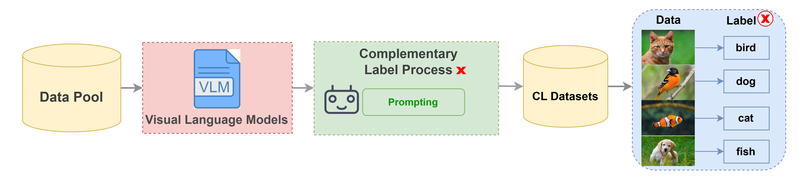
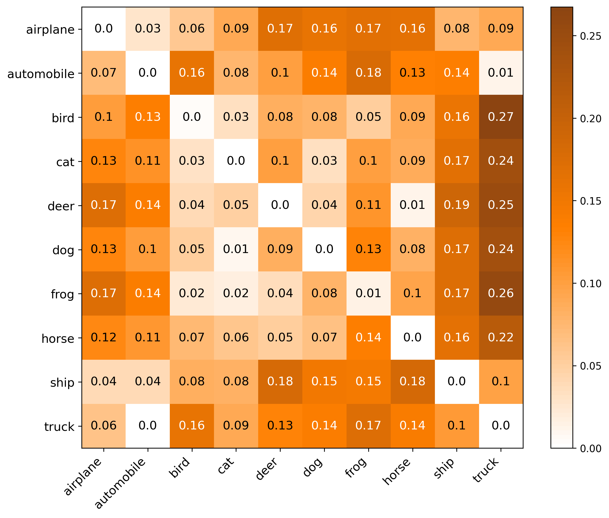
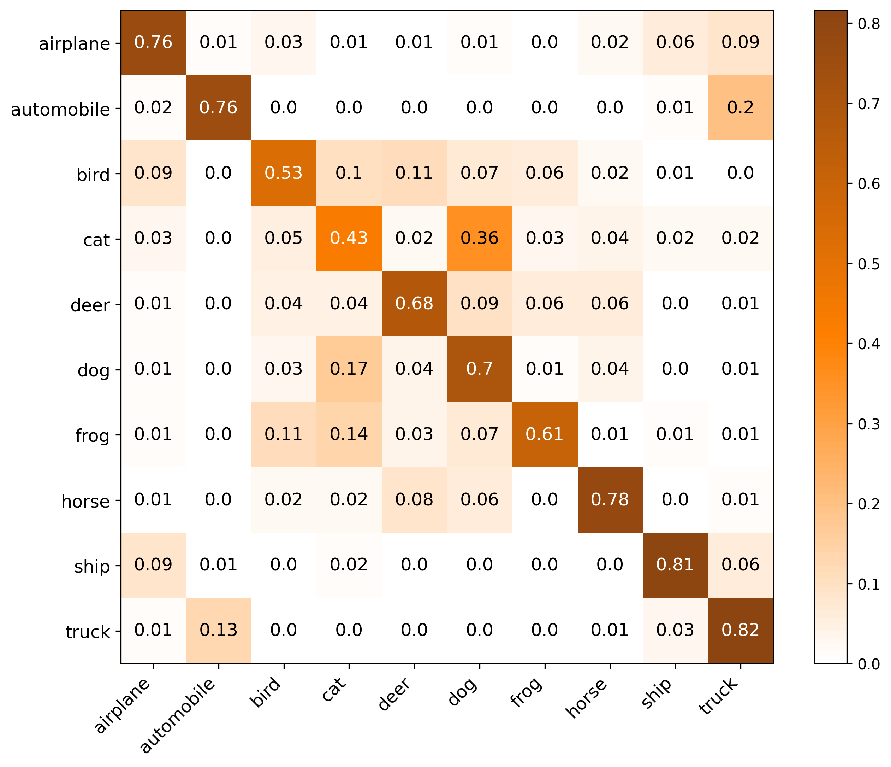
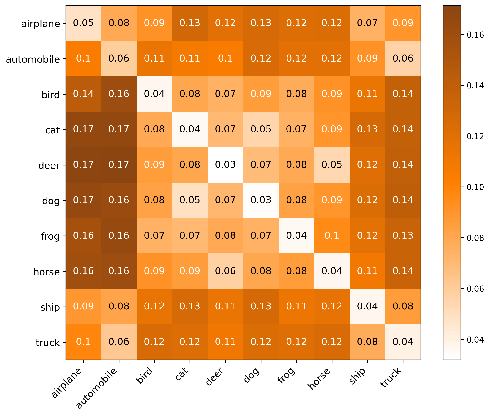
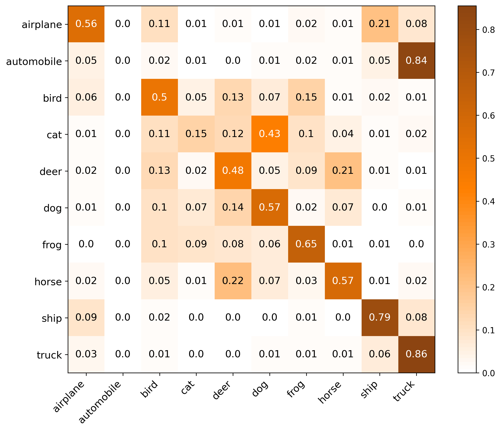
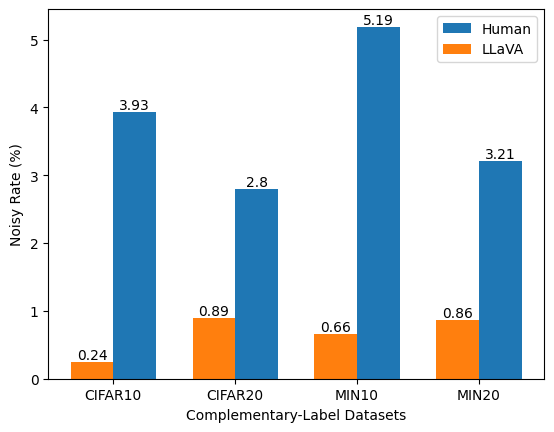
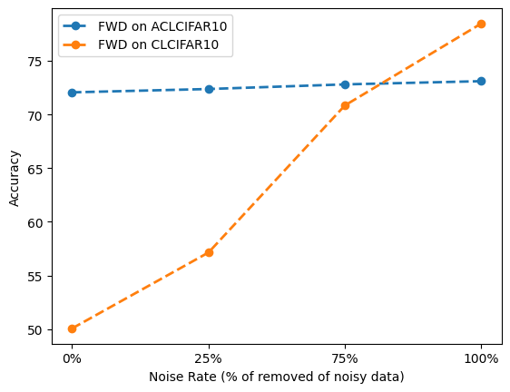
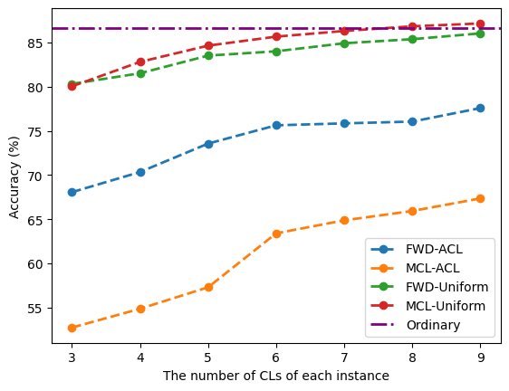

# Auto Labeling

## Introduction

This is a tool to run auto labeling by VLM(llava-v1.6-mistral-7b-hf) on both complementary label and ordinary label. It should associate with [libcll](https://github.com/ntucllab/libcll).　We have used this package effectively curates VLM-annotated datasets, achieving an improvement of 10\% performance over human-annotated datasets.



## Results and Analysis

### The comparison between FWD predictions learned from human-labeled and VLM-labeled datasets.

#### ACLCIFAR10 Transition Matrix & Testing Accuracy

| ACLCIFAR10 Transition Matrix | ACLCIFAR10 Testing Accuracy |
|------------------------------|-----------------------------|
|  |  |


#### CLCIFAR10 Transition Matrix & Testing Accuracy

| CLCIFAR10 Transition Matrix | CLCIFAR10 Testing Accuracy |
|-----------------------------|----------------------------|
|  |  |

### Performance of CLL algorithms with reducing biasedness approach


|                | ACLCIFAR10-**R**                 | ACLCIFAR10                  | ACLMIN10-**R**                | ACLMIN10                   |
|----------------|----------------------------------|-----------------------------|--------------------------------|----------------------------|
| **SCL-NL**     | <u>64.46</u> ± 0.48             | **53.37** ± 0.50           | <u>24.72</u> ± 0.70           | <u>16.21</u> ± 0.62       |
| **SCL-EXP**    | 62.35 ± 0.73                    | 33.20 ± 3.68               | 21.98 ± 0.77                  | 16.16 ± 1.21              |
| **MCL-LOG**    | **64.92** ± 0.52                | <u>52.79</u> ± 0.25        | **27.38** ± 3.03              | **16.57** ± 0.75          |
|---------------|---------------------------------|----------------------------|-------------------------------|---------------------------|
| **FWD**        | **71.03** ± 0.44                | **69.49** ± 1.16           | <u>51.29</u> ± 2.64           | **49.42** ± 3.56          |
| **CPE-F**      | <u>70.81</u> ± 0.08             | <u>69.10</u> ± 1.11        | **51.30** ± 2.91              | <u>48.98</u> ± 3.05       |
| **CPE-T**      | 63.56 ± 0.53                    | 62.43 ± 1.21               | 47.76 ± 1.26                  | 43.00 ± 2.37              |


#### Visualization of Complementary Label Noise Levels and Results

| Complementary Label Noise <br> Levels Across Datasets | Result of Noisy Label <br> Cleaning on ACLCIFAR10 | Result of Incremental <br> CLs on ACLCIFAR10 |
|--------------------------------------------------|---------------------------------------------|------------------------------------------|
|  |  |  |

## Installation

- Python version >= 3.8, <= 3.12
- Pytorch version >= 1.11, <= 2.0
- Pytorch Lightning version >= 2.0

```
git clone https://github.com/yahcreepers/auto_labeling.git
cd auto_labeling
pip install -r requirements.txt
cd ..
git clone https://github.com/ntucllab/libcll.git
cd libcll
pip install -e .
```

## Configuration

### Supported datasets

| Dataset     | Number of Classes | Input Size  | Description                                                  |
| ----------- | --------------- | ----------- | ------------------------------------------------------------ |
| CIFAR10 | 10 | 3 x 32 x 32 | Colored images of different objects. |
| CIFAR20     | 20              | 3 x 32 x 32 | Colored images of different objects. |
| Micro ImageNet10 | 10 | 3 x 64 x 64 | Contains images of 10 classes designed for computer vision research|
| Micro ImageNet20 | 20 | 3 x 64 x 64 | Contains images of 20 classes designed for computer vision research|

### Supported Stratgies

| Strategies                                                | Type             | Description                                                  |
| --------------------------------------------------------- | ---------------- | ------------------------------------------------------------ |
| [SCL](https://arxiv.org/pdf/2007.02235.pdf)               | NL, EXP          | Surrogate Complementary Loss with the negative log loss (NL) or with the exponential loss (EXP) |
| [URE](https://arxiv.org/pdf/1810.04327.pdf)               | NN, GA, TNN, TGA | Unbiased Risk Estimator whether with gradient ascent (GA) or empirical transition matrix (T) |
| [FWD](https://arxiv.org/pdf/1711.09535.pdf)               | None             | Forward Correction                                           |
| [DM](http://proceedings.mlr.press/v139/gao21d/gao21d.pdf) | None             | Discriminative Models with Weighted Loss                     |
| [CPE](https://arxiv.org/pdf/2209.09500.pdf)               | I, F, T          | Complementary Probability Estimates with different transition matrices (I, F, T) |
| [MCL](https://arxiv.org/pdf/1912.12927.pdf)               | MAE, EXP, LOG    | Multiple Complementary Label learning with different errors (MAE, EXP, LOG) |

For more information, please reference to [libcll](https://github.com/ntucllab/libcll).

## Datasets

This repo contains four datasets: ACLCIFAR10, ACLCIFAR20, ACLMicroImageNet10, and ACLMicroImageNet20 with auto labeling complementary labels for complementary label learning tasks.

TL;DR: the download links to ACLCIFAR and ACLMicroImageNet dataset
* ACLCIFAR10: [aclcifar10.pkl](https://drive.google.com/file/d/1Tn4-sidFRtJ_Q0M9EJXnUxeodp_hO-wF/view?usp=sharing) (149MB)
* ACLCIFAR10-R: [aclcifar10r.pkl](https://drive.google.com/file/d/1SkA4A7Tn8nHx6xHfpE8XrcJ6FHveVH60/view?usp=sharing) (149MB)
* ACLCIFAR20: [aclcifar20.pkl](https://drive.google.com/file/d/12MVz5gRKKXrznELt3NholwAmnvvCVJGh/view?usp=sharing) (151MB)
* ACLMIN10: [aclmin10.pkl](https://drive.google.com/file/d/1mYCfykcbifm0WHdJzLCbuH4wiAloqL5Z/view?usp=sharing) (59MB)
* ACLMIN10-R: [aclmin10r.pkl](https://drive.google.com/file/d/1g-c82-ntKlDHF3I6uRo8e6aFHS35RSXJ/view?usp=sharing) (59MB)
* CLMicroImageNet20: [aclmin20.pkl](https://drive.google.com/file/d/1a8bD0Nu__eX1qq1ncuOhjsn46GY9wd5X/view?usp=sharing) (119MB)


### ACLCIFAR10

This Complementary labeled CIFAR10 dataset contains auto-labeled complementary labels for all 50000 images in the training split of CIFAR10.

For more details, please visit our paper at link.

#### Dataset Structure

ACLCIFAR10 Dataset download link: [aclcifar10.pkl](https://drive.google.com/file/d/1Tn4-sidFRtJ_Q0M9EJXnUxeodp_hO-wF/view?usp=sharing) (149MB)

ACLCIFAR10-R Dataset download link: [aclcifar10r.pkl](https://drive.google.com/file/d/1SkA4A7Tn8nHx6xHfpE8XrcJ6FHveVH60/view?usp=sharing) (149MB)

We use `pickle` package to save and load the dataset objects. Use the function `pickle.load` to load the dataset dictionary object `data` in Python.

```python
data = pickle.load(open("aclcifar10.pkl", "rb"))
# keys of data: 'names', 'images', 'ord_labels', 'cl_labels'
```

`data` would be a dictionary object with four keys: `names`, `images`, `ord_labels`, `cl_labels`.

* `names`: The list of filenames strings. This filenames are same as the ones in CIFAR10

* `images`: A `numpy.ndarray` of size (32, 32, 3) representing the image data with 3 channels, 32*32 resolution.

* `ord_labels`: The ordinary labels of the images, and they are labeled from 0 to 9 as follows:

  0: airplane
  1: automobile
  2: bird
  3: cat
  4: deer
  5: dog
  6: frog
  7: horse
  8: ship
  9: truck

* `cl_labels`: Three complementary labels for each image.

### ACLCIFAR20

This Complementary labeled CIFAR100 dataset contains auto-labeled complementary labels for all 50000 images in the training split of CIFAR100. We group 4-6 categories as a superclass according to [[1]](https://arxiv.org/abs/2110.12088) and collect the complementary labels of these 20 superclasses.

#### Dataset Structure

Dataset download link: [aclcifar20.pkl](https://drive.google.com/file/d/12MVz5gRKKXrznELt3NholwAmnvvCVJGh/view?usp=sharing) (151MB)

We use `pickle` package to save and load the dataset objects. Use the function `pickle.load` to load the dataset dictionary object `data` in Python.

```python
data = pickle.load(open("aclcifar20.pkl", "rb"))
# keys of data: 'names', 'images', 'ord_labels', 'cl_labels'
```

`data` would be a dictionary object with four keys: `names`, `images`, `ord_labels`, `cl_labels`.

* `names`: The list of filenames strings. This filenames are same as the ones in CIFAR20

* `images`: A `numpy.ndarray` of size (32, 32, 3) representing the image data with 3 channels, 32*32 resolution.

* `ord_labels`: The ordinary labels of the images, and they are labeled from 0 to 19 as follows:

  0: aquatic_mammals
  1: fish
  2: flowers
  3: food_containers
  4: fruit, vegetables and mushrooms
  5: household electrical devices
  6: household furniture
  7: insects
  8: large carnivores and bear
  9: large man-made outdoor things
  10: large natural outdoor scenes
  11: large omnivores and herbivores
  12: medium-sized mammals
  13: non-insect invertebrates
  14: people
  15: reptiles
  16: small mammals
  17: trees
  18: transportation vehicles
  19: non-transportation vehicles

* `cl_labels`: Three complementary labels for each image.

### ACLMicroImageNet10

This Complementary labeled MicroImageNet10 dataset contains auto-labeled complementary labels for all 5000 images in the training split of TinyImageNet200.

For more details, please visit our paper at link.

#### Dataset Structure

ACLMIN10 Dataset download link: [aclmin10.pkl](https://drive.google.com/file/d/1mYCfykcbifm0WHdJzLCbuH4wiAloqL5Z/view?usp=sharing) (59MB)

ACLMIN10-R Dataset download link: [aclmin10r.pkl](https://drive.google.com/file/d/1g-c82-ntKlDHF3I6uRo8e6aFHS35RSXJ/view?usp=sharing) (59MB)

We use `pickle` package to save and load the dataset objects. Use the function `pickle.load` to load the dataset dictionary object `data` in Python.

```python
data = pickle.load(open("aclmin10.pkl", "rb"))
# keys of data: 'names', 'images', 'ord_labels', 'cl_labels'
```

`data` would be a dictionary object with four keys: `names`, `images`, `ord_labels`, `cl_labels`.

* `names`: The list of filenames strings. This filenames are same as the ones in MicroImageNet10

* `images`: A `numpy.ndarray` of size (32, 32, 3) representing the image data with 3 channels, 32*32 resolution.

* `ord_labels`: The ordinary labels of the images, and they are labeled from 0 to 9 as follows:

  0: sulphur-butterfly
  1: backpack
  2: cardigan
  3: kimono
  4: magnetic-compass
  5: oboe
  6: scandal
  7: torch
  8: pizza
  9: alp

* `cl_labels`: Three complementary labels for each image.

### ACLMicroImageNet20

This Complementary labeled MicroImageNet20 dataset contains auto-labeled complementary labels for all 10000 images in the training split of TinyImageNet200.

For more details, please visit our paper at link.

#### Dataset Structure

Dataset download link: [aclmin20.pkl](https://drive.google.com/file/d/1a8bD0Nu__eX1qq1ncuOhjsn46GY9wd5X/view?usp=sharing) (119MB)

We use `pickle` package to save and load the dataset objects. Use the function `pickle.load` to load the dataset dictionary object `data` in Python.

```python
data = pickle.load(open("clmicro_imagenet20_train.pkl", "rb"))
# keys of data: 'names', 'images', 'ord_labels', 'cl_labels'
```

`data` would be a dictionary object with four keys: `names`, `images`, `ord_labels`, `cl_labels`.

* `names`: The list of filenames strings. This filenames are same as the ones in MicroImageNet20

* `images`: A `numpy.ndarray` of size (32, 32, 3) representing the image data with 3 channels, 32*32 resolution.

* `ord_labels`: The ordinary labels of the images, and they are labeled from 0 to 19 as follows:

  0: tailed frog
  1: scorpion
  2: snail
  3: american lobster
  4: tabby
  5: persian cat
  6: gazelle
  7: chimpanzee
  8: bannister
  9: barrel
  10: christmas stocking
  11: gasmask
  12: hourglass
  13: iPod
  14: scoreboard
  15: snorkel
  16: suspension bridge
  17: torch
  18: tractor
  19: triumphal arch

* `cl_labels`: Three complementary labels for each image.

## Running

You can change it to your own prompt by modifying `models/llava_next.py`

### For Auto-Labeling

#### Complementary Label

```
python main.py \
--model llava \
--dataset cifar10 \
--batch_size 8 \
--seed 1126 \
--num_rounds 3 \
--output_dir logs/ \
--auto_cl \ # collecting complementary labels or ordinary labels
--long_label # using whole label names instead of only one word abbreviation
```

#### Ordinary Label

```
python main.py \
--model llava \
--dataset cifar10 \
--batch_size 8 \
--seed 1126 \
--num_rounds 3 \
--output_dir logs/ \
--long_label # using whole label names instead of only one word abbreviation
```

### For Training

#### Complementary Label

```
python train.py \
    --strategy ${stradegy}\
    --type ${tp} \
    --model ${model} \
    --dataset ${dataset} \
    --lr ${lr} \
    --batch_size ${batch_size} \
    --epoch 300 \
    --valid_type Accuracy \
    --output_dir ${output_dir} \
    --label_path ${label_path} \
    --long_label \
    --do_transform \
```

### Ordinary Label


```
python train.py \
    --strategy Ord\
    --type ${type} \
    --model ${model} \
    --dataset ${dataset} \
    --lr ${lr} \
    --batch_size ${batch_size} \
    --epoch 300 \
    --valid_type Accuracy \
    --output_dir ${output_dir} \
    --label_path ${label_path} \
    --long_label \
    --do_transform \
```

## References
[llava in hugging face](https://huggingface.co/docs/transformers/model_doc/llava_next)
