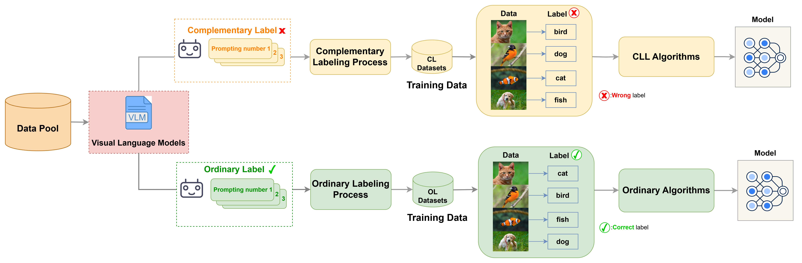

# Auto Labeling

## Introduction

This is a tool to run auto labeling by VLM(llava-v1.6-mistral-7b-hf) on both complementary label and ordinary label. It should associate with [libcll](https://github.com/ntucllab/libcll).　We have used this package effectively curates VLM-annotated datasets, achieving an improvement of 10\% performance over human-annotated datasets.




## Installation

- Python version >= 3.8, <= 3.12
- Pytorch version >= 1.11, <= 2.0
- Pytorch Lightning version >= 2.0

```
git clone https://github.com/yahcreepers/auto_labeling.git
cd auto_labeling
pip install -r requirements.txt
cd ..
git clone https://github.com/ntucllab/libcll.git
cd libcll
pip install -e .
```

## Configuration

### Supported datasets

| Dataset     | Number of Classes | Input Size  | Description                                                  |
| ----------- | --------------- | ----------- | ------------------------------------------------------------ |
| CIFAR10 | 10 | 3 x 32 x 32 | Colored images of different objects. |
| CIFAR20     | 20              | 3 x 32 x 32 | Colored images of different objects. |
| CIFAR20     | 100              | 3 x 32 x 32 | Colored images of different objects. |
| Micro ImageNet10 | 10 | 3 x 64 x 64 | Contains images of 10 classes designed for computer vision research|
| Micro ImageNet20 | 20 | 3 x 64 x 64 | Contains images of 20 classes designed for computer vision research|

### Supported Stratgies

| Strategies                                                | Type             | Description                                                  |
| --------------------------------------------------------- | ---------------- | ------------------------------------------------------------ |
| [SCL](https://arxiv.org/pdf/2007.02235.pdf)               | NL, EXP          | Surrogate Complementary Loss with the negative log loss (NL) or with the exponential loss (EXP) |
| [URE](https://arxiv.org/pdf/1810.04327.pdf)               | NN, GA, TNN, TGA | Unbiased Risk Estimator whether with gradient ascent (GA) or empirical transition matrix (T) |
| [FWD](https://arxiv.org/pdf/1711.09535.pdf)               | None             | Forward Correction                                           |
| [DM](http://proceedings.mlr.press/v139/gao21d/gao21d.pdf) | None             | Discriminative Models with Weighted Loss                     |
| [CPE](https://arxiv.org/pdf/2209.09500.pdf)               | I, F, T          | Complementary Probability Estimates with different transition matrices (I, F, T) |
| [MCL](https://arxiv.org/pdf/1912.12927.pdf)               | MAE, EXP, LOG    | Multiple Complementary Label learning with different errors (MAE, EXP, LOG) |

For more information, please reference to [libcll](https://github.com/ntucllab/libcll).

## Running

You can change it to your own prompt by modifying `models/llava_next.py`

### For Auto-Labeling

#### Complementary Label

```
python main.py \
--model llava \
--dataset cifar10 \
--batch_size 8 \
--seed 1126 \
--num_rounds 3 \
--output_dir logs/ \
--auto_cl \ # collecting complementary labels or ordinary labels
--long_label # using whole label names instead of only one word abbreviation
```

#### Ordinary Label

```
python main.py \
--model llava \
--dataset cifar10 \
--batch_size 8 \
--seed 1126 \
--num_rounds 3 \
--output_dir logs/ \
--long_label # using whole label names instead of only one word abbreviation
```

### For Training

#### Complementary Label

```
python train.py \
    --strategy ${stradegy}\
    --type ${tp} \
    --model ${model} \
    --dataset ${dataset} \
    --lr ${lr} \
    --batch_size ${batch_size} \
    --epoch 300 \
    --valid_type Accuracy \
    --output_dir ${output_dir} \
    --label_path ${label_path} \
    --long_label \
    --do_transform \
```

### Ordinary Label


```
python train.py \
    --strategy Ord\
    --type ${type} \
    --model ${model} \
    --dataset ${dataset} \
    --lr ${lr} \
    --batch_size ${batch_size} \
    --epoch 300 \
    --valid_type Accuracy \
    --output_dir ${output_dir} \
    --label_path ${label_path} \
    --long_label \
    --do_transform \
```

## References
[llava in hugging face](https://huggingface.co/docs/transformers/model_doc/llava_next)